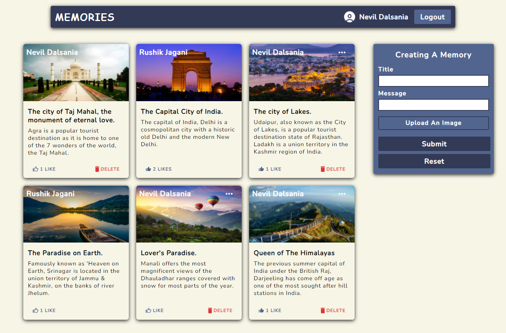
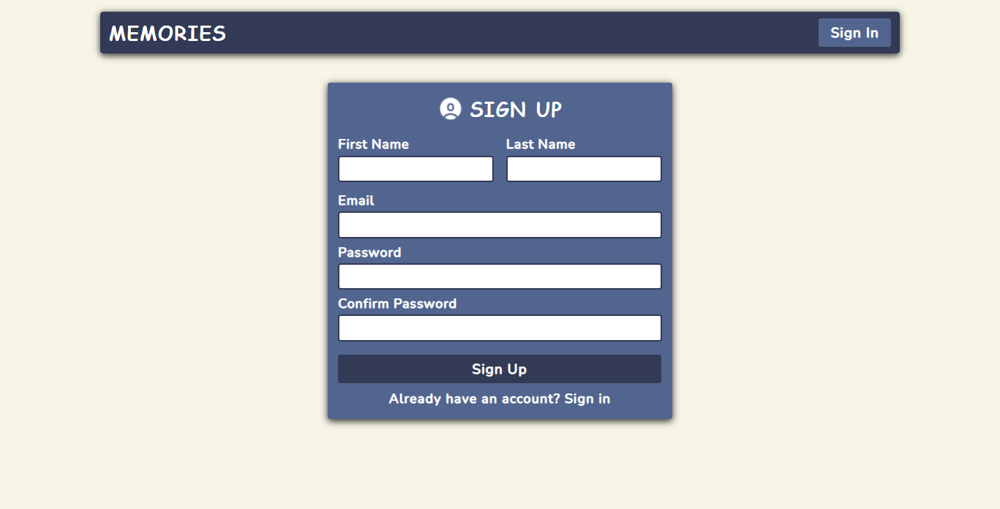
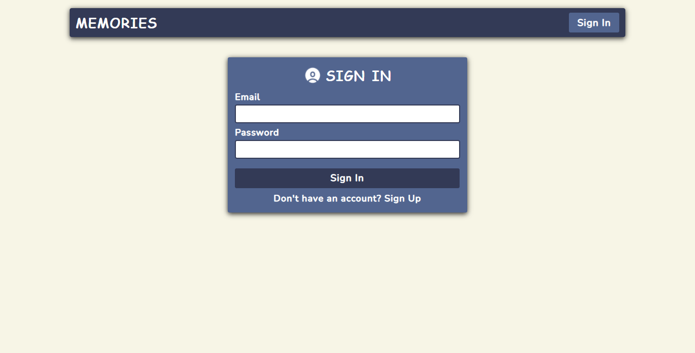

# Memories-Project
### This a memories website built using MERN stack which have login, signup, creating a memory, editing a memory, like the memory, delete the memory functionalities in it.
&nbsp;

&nbsp;

&nbsp;

&nbsp;
